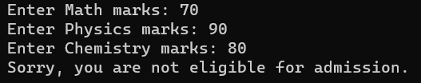

# Eligibility-for-Engineering-Admission
## Aim:
To write a C# program to check whether the student is eligibile for the engineering admission

## Algorithm:
### Step1: 
Get the maths, chemistry and physics marks from the user using ReadLine().
### Step2: 
Calculate the sum of all three subjects and check whether the sum is greater than and equal to 180

### Step3:
Calculate the sum of physics and maths and check the condition

### Step4:
Check whether all the subject marks are above the minimum marks.

### Step5:
Check for the given criteria for eligibility using if-else statements.

### Step6:
Display whether the person is eligible for admission or not based on the given criteria.

## Program:
```
using System;
namespace admission
{
    class Eligibility
    {
        static void Main(string[] args)
        {
           int maths, physics, chemistry;

            Console.Write("Enter Math marks: ");
            maths = Convert.ToInt32(Console.ReadLine());

            Console.Write("Enter Physics marks: ");
            physics = Convert.ToInt32(Console.ReadLine());

            Console.Write("Enter Chemistry marks: ");
            chemistry = Convert.ToInt32(Console.ReadLine());

            int totalMarks = maths + physics + chemistry;

            if (maths >= 75 && physics >= 65 && chemistry >= 60 && (totalMarks >= 180 || totalMarks >= 140))
            {
               Console.WriteLine("Congratulations! You are eligible for admission.");
            }
            else
            Console.WriteLine("Sorry, you are not eligible for admission.");
        }
    }
}
```
## Output:


## Result:
Thus the above C# program to check the eligibility of engineering admission is successfully executed

